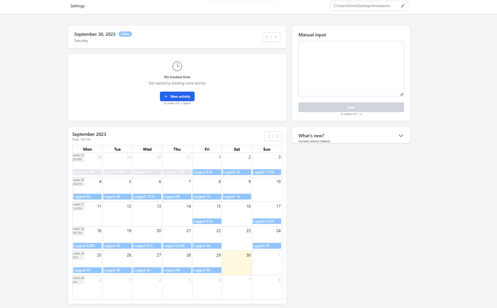

[![Forks][forks-shield]][forks-url]
[![MIT License][license-shield]][license-url]
[![LinkedIn][linkedin-shield]][linkedin-url]

# Timetracker

## About The Project

This is an application for creating a reports of the time spent on activities across projects.
Using this application, you can:

- Choose the location for time tracker reports.
- Select the date for the report.
- Create activity reports using a form with relevant fields.
- Format the reports within the form.
- Create and edit reports in a text field.

This application creates a file in plain text format with the data entered into the tracker.
The file name is the date in the format yyyymmdd. The data in the file is stored in the format "hh:mm - project - activity - description", where hh:mm represents the start time of the activity. If there is no subsequent activity following the end of one, the end time of the activity is marked as "hh:mm - !"



### Built With

- TypeScript
- Next.js
- Electron
- Tailwind

## Getting Started

To get a local copy up and running follow these simple example steps.

### Installation

1. Clone the repo
   ```sh
   git clone https://github.com/mmmykhailo/timetracker.git
   ```
2. Install packages

   ```sh
   npm i
   ```

   ```sh
   yarn
   ```

   ```sh
   pnpm i
   ```

## Usage

Development mode

```sh
pnpm run dev
```

Production build

```sh
npm run dist
```

## Github Actions (CI/CD)

App version in `package.json` modify using tag version (tag`v0.0.1` -> `0.0.1`)

## Contact

Telegram: [@mrdr_scn](https://t.me/mrdr_scn)

<!-- MARKDOWN LINKS & IMAGES -->
<!-- https://www.markdownguide.org/basic-syntax/#reference-style-links -->

[forks-shield]: https://img.shields.io/github/forks/mmmykhailo/timetracker.svg?style=for-the-badge
[forks-url]: https://github.com/mmmykhailo/timetracker/network/members
[stars-shield]: https://img.shields.io/github/stars/mmmykhailo/timetracker.svg?style=for-the-badge
[license-shield]: https://img.shields.io/github/license/mmmykhailo/timetracker.svg?style=for-the-badge
[license-url]: https://github.com/mmmykhailo/timetracker/blob/master/LICENSE.txt
[linkedin-shield]: https://img.shields.io/badge/-LinkedIn-black.svg?style=for-the-badge&logo=linkedin&colorB=555
[linkedin-url]: https://linkedin.com/in/mmmykhailo
[product-screenshot]: images/screenshot.png
